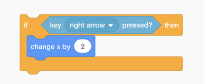
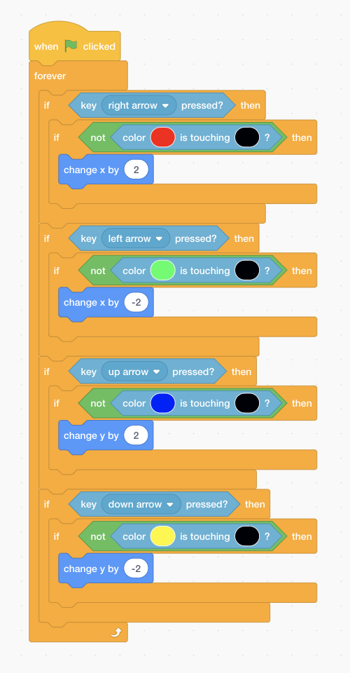

Aim: Movement  
Time: 40 mins  
[Slides]()  
[Code]()

In Lesson 1 we will get cubert to move around the maze without going through the walls. 

Firstly, we have to initialise the initial variables. These include Cubert's starting position and the level 1 backdrop.

* When Green Flag is clicked
* Show Cubert (if cubert is hidden)
* Move Cubert to x:-166, y:-130 (Starting position)

Now we can start working on the movement. We check if the right arrow key is pressed. If it is, we move cubert to the right.

* If Right Arrow Key is pressed
    * Move cubert by 2 units along the x axis (2 units to the right).

All we have to do now is to add an If Green Flag is Clicked block and a Forever Loop. Cubert now moves to the right when you click the Green Flag.

However, Cubert still cannot detect the walls and will move through it. To fix this, let's add some collision detection! Notice that Cubert has 4 different sides, each with a different colour. We will use these colours to determine which side of Cubert is touching a wall. 

We modify the if block with an extra if statement that checks if the colour Red (the right side of cubert) is touching the colour Black (the wall of the maze). Only if it is not touching will we allow cubert to move to the right. The code block should now look like this.

* When Green Flag is Clicked
* Run Forever
    * If the right arrow key is pressed
        * If the colour red (the right edge of cubert) is touching the colour black (the wall of the maze)
            * Then move cubert 2 units in the x direction (2 units to the right)

Now let's do the same for the other 3 directions to finish up lesson 1!

Cubert should now be able to move around the maze without going through any walls.