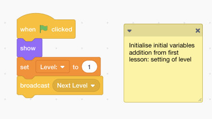

Aim: Exit and Multiple Levels  
Time: 40 mins  
[Lesson Materials](https://drive.google.com/drive/folders/1mgmY-0kgZxOuCrxqJ7fYAadMBnw3YsPt?usp=sharing)

In lesson 2, we will help Cubert escape the maze by creating an exit which will teleport Cubert to the next level.

First, we import the exit sprite and backdrop for level 2.

Since we are working with levels, lets initialise the Level variable. We make sure the variable level is set to 1 when we start running the program. Modify the existing code block by adding "set level to 1" block.

Now we can start working on the exit. Place the exit sprite at the exit of the maze.

Try moving Cubert to the Exit! Nothing happens because we have not told the program what to do when Cubert touches the Exit.

When Cubert touches the exit, 3 things should happen.
1. The backdrop changes to level 2 backdrop
2. Cubert moves to a new starting location
3. The Exit Spite moves to a new exit location

To do this, we will utilise Broadcast and Receive blocks, a way for different blocks of code to communicate with one another.

When Cubert touches the exit sprite, we want to increase the variable Level by 1 as well as broadcast Next Level. All blocks that are listening out for the Next Level message will run when Next Level is broadcasted.

* When Green Flag is Clicked
    * Run Forever
        * If Cubert is touching Exit sprite
            * Hide Cubert (So that he does not touch the exit sprite multiple times)
            * Change level by 1 (This increases level by 1)
            * Broadcast "Next Level" (All blocks listening out for the "Next Level" message will now run)

Now we can work on changing the backdrop and moving to a new starting location. Code blocks can listen for the Next Level message using the "when I receive Next Level" block. When it receives the message, it should check the current level and set the correct starting position and backdrop.

* when I receive "Next Level" message
    * Show Cubert
    * if it is level 2 then
        * go to x:-136, y: -147 (level 2 starting postion)
        * change backdrop to level 2 (level 2 maze backdrop)
    * go to front layer (ensures cubert will always appear in front of other objects)

Now that the starting position and backdrop have been settled, we are only left with setting the new position of the exit sprite.

Click on the exit sprite. Whatever code blocks you place here will now only affect the exit sprite. Just like the position of cubert and backdrop, we listen for the next level message and move to the correct positions

* when I receive "Next Level"
    * Show Exit Sprite (in case it is hidden)
    * if level is 1
        * move to x:194, y:-17 (level 1 exit position)
    * if level is 2
        * move to x:99, y:141 (level 2 exit position)

Now all we have left to do is to clean up the code a little bit. As programmers, it is good practice to group blocks that do similar things together, so that they are easy to find next time if you need to change anything. 

Click on the Cubert Sprite. In the code block initialises variables, let's take out the two blocks that deal with position of Cubert and the Backdrop and place them inside the code block that checks the level and changes the position accordingly. We also need to add a broadcast block to the code block that initialises variables.

The two blocks should now look like this.

Try finishing the maze now! A new Maze level should load and Cubert and the Exit sprite should be in the correct postions for level 2.

<LinkLeft to="../lesson1">Lesson 1</LinkLeft>
<LinkRight to="../lesson3">Lesson 3</LinkRight>