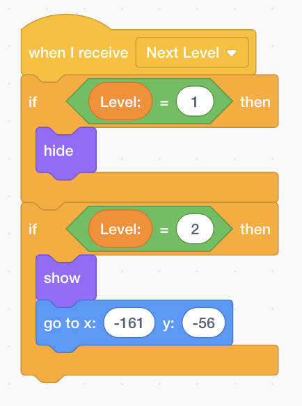
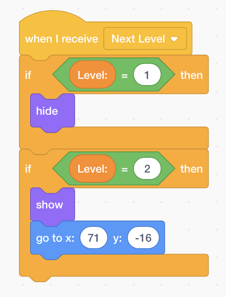
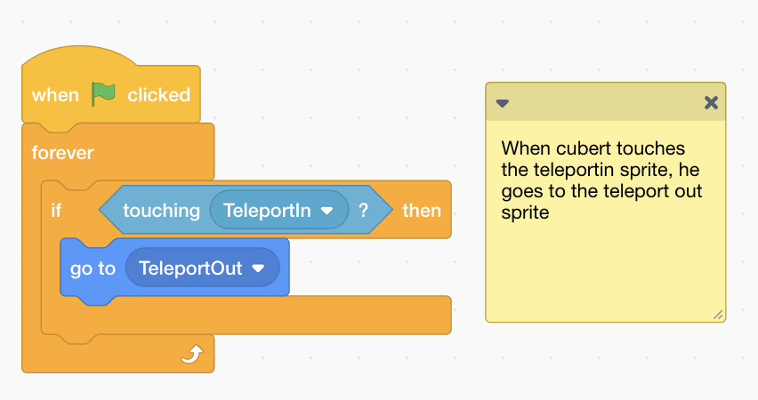
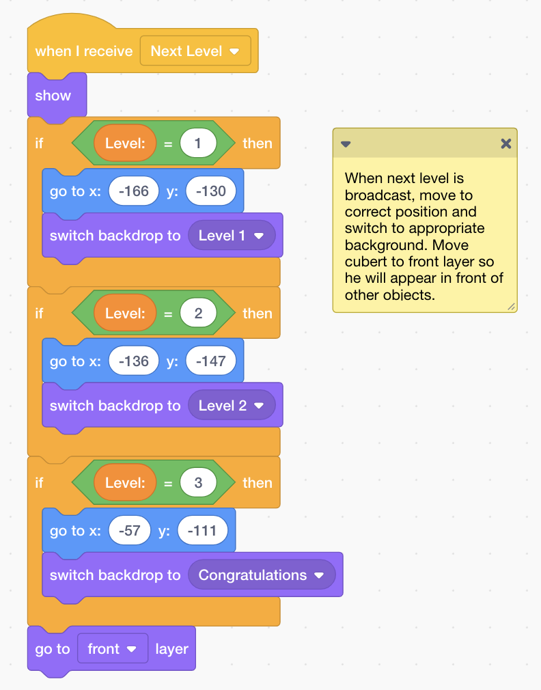
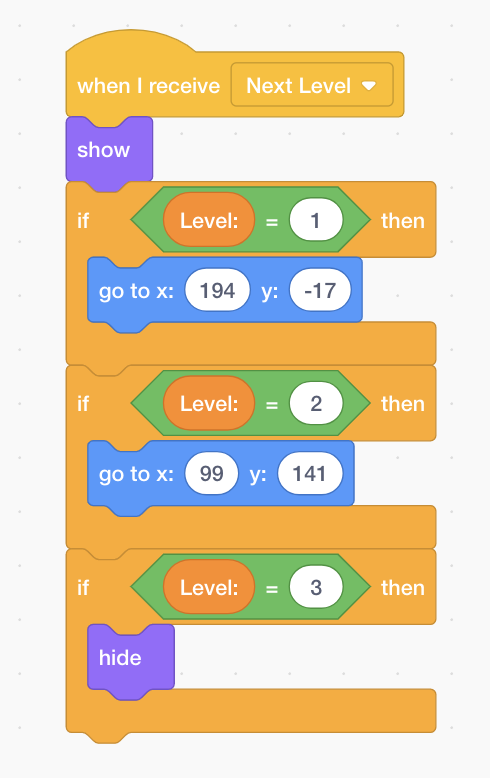
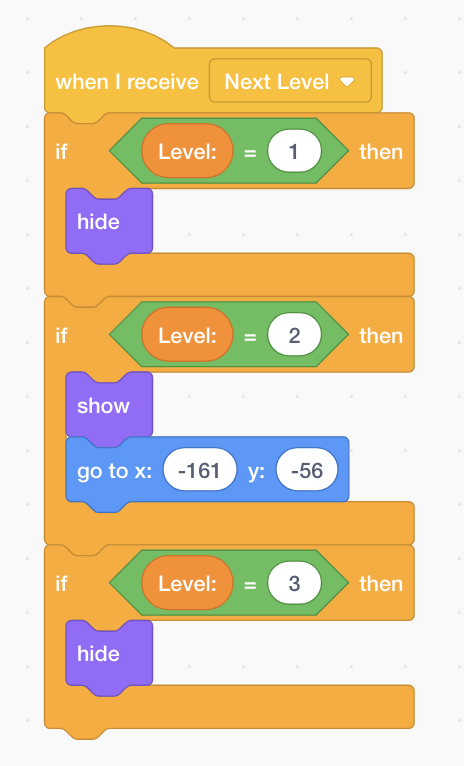
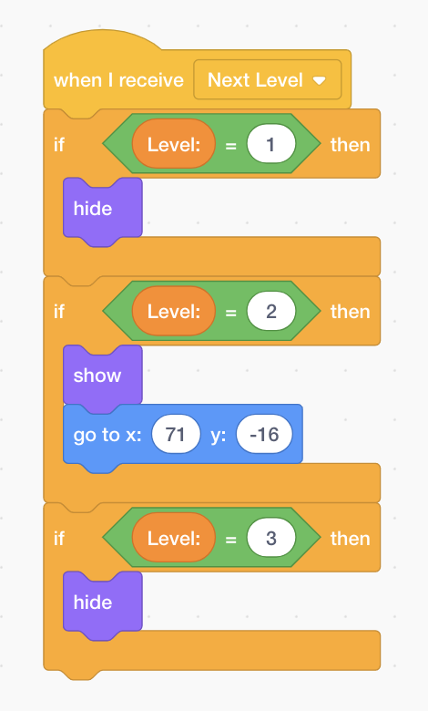

Aim: Build Teleporters  
Time: 40 mins  
[Lesson Materials](https://drive.google.com/drive/folders/1mgmY-0kgZxOuCrxqJ7fYAadMBnw3YsPt?usp=sharing)

In the last lesson, we helped Cubert escape the first Maze. However, he is now faced with an even more difficult Maze! Try is out! Cubert is unfortunately stuck in the lower left area of the maze.

Not to worry, in this lesson we will help Cubert escape the final Maze by creating a teleporter!

First, we import the teleporter sprite twice. Label one as TeleportIn and the other TeleportOut.

We now need to set the correct positions for the TeleportIn and TeleportOut sprite. Similar to the exit sprite, we listen out for the Next Level message and move the Teleporters to the correct location.

For TeleportIn:

For TeleportOut:

For levels with no teleporter, we simply hide the sprite.

Now we need to make cubert teleport. When Cubert touches the TeleportIn sprite, he should teleport to the TeleportOut sprite. Add this to the Cubert Sprite.

* When Green Flag is Clicked
    * Run Forever
        * if Cubert is touching TeleportIn
            * then move to TeleportOut

Try it out! When cubert touches the TeleportIn sprite, he should appear again at the TeleportOut sprite.

Now all that's left to do is to implement the congragulations Backdrop! Import the congratulations backdrop. Change the relevant parts of the code too add level 3. The blocks that have changed are shown below.

For Cubert:

For Exit Sprite:

For TeleportIn:

For TeleportOut:

Try the game again! Cubert has successfully escaped the Maze!
You should now see a congratulations screen.

If you would like to add even more features to the game, here are some ideas!
* Modify size of cubert or maze to make it more challenging to move around.
* Spikes - When touched it should bring you back to the starting point.
* Sounds - Play a sound when cubert reaches an exit or touches a teleporter.
* Multiplayer - Two different Cuberts that compete to see who can finish the maze in the fastest possible time.

<LinkLeft to="../lesson2">Lesson 2</LinkLeft>